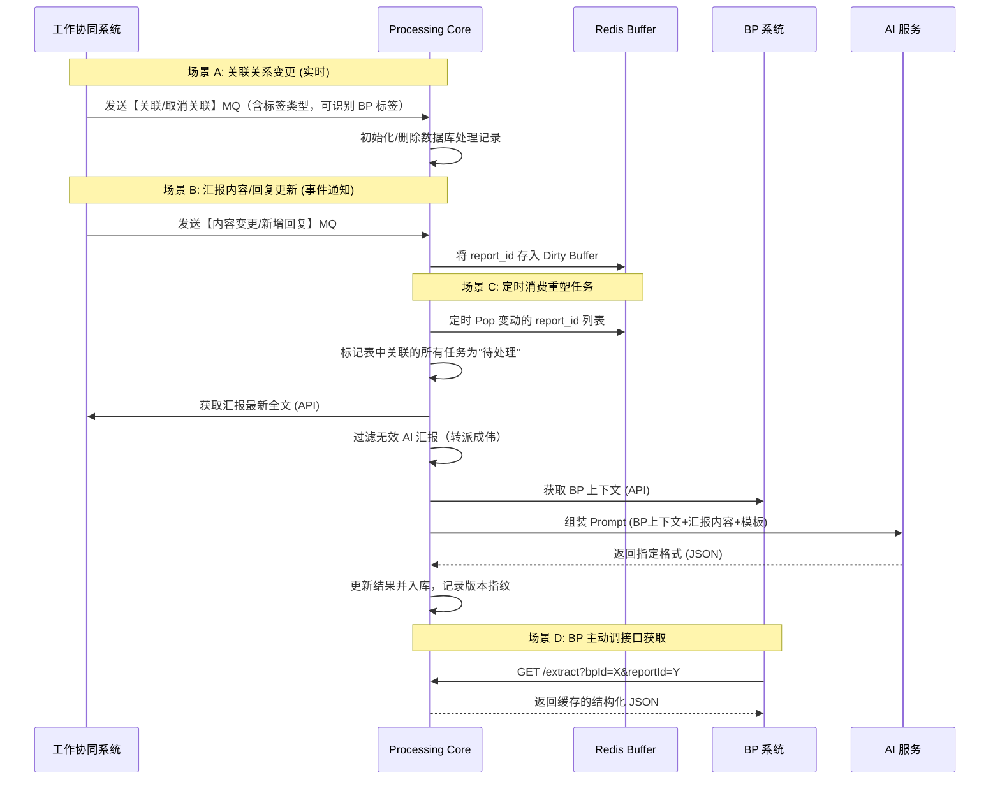
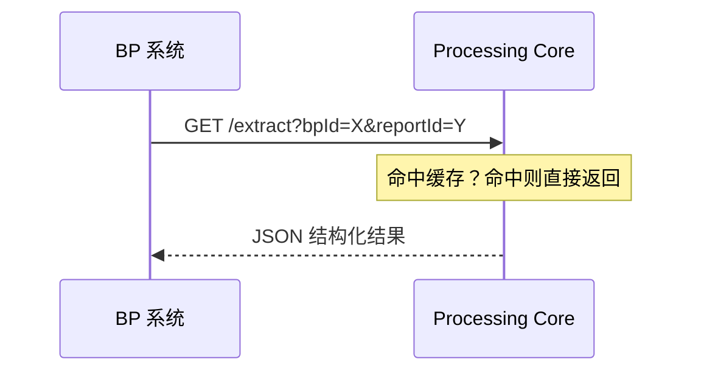

# cms-work-adapter 实现方案

> 基于 Evan 确认的方案目标 + JSON Schema，出具本实现方案。
> 原始方案来源：`原始方案-工作汇报AI内容处理系统详细设计方案.md`

---

## 1. 方案目标

构建工作协同内容适配器（Processing Core），在工作协同系统与 BP 系统之间建立标准化的数据交换规范。

**核心价值：**
- 工作协同系统与 BP 系统解耦——两边都只感知 Processing Core，不知道对方存在
- 一次加工，多方复用——工作协同变更时预加工，消费方调用时实时响应
- 通过标签类型区分 BP 标签和其他标签，Processing Core 按标签类型识别 BP 关联

---

## 2. 架构定位

```
┌─────────────────┐         ┌─────────────────┐         ┌─────────────────┐
│  工作协同系统    │◄───────►│ Processing Core │◄───────►│   BP 系统       │
│  (不知道 BP)    │  MQ/Http │  (本系统)       │  API/Http│  (不知道工作协同)│
└─────────────────┘         └─────────────────┘         └─────────────────┘
```

**三个角色解耦：**
- 工作协同系统 ↔ Processing Core（单向通信，不知道 BP 存在）
- BP 系统 ↔ Processing Core（单向通信，不知道工作协同存在）
- 工作协同系统 × BP 系统（无直接通信）

**关联关系：** 存储在工作协同系统侧（BP 标签注入，标签类型区分 BP/非 BP）

---

## 3. 系统交互流程

### 3.1 主流程：Processing Core 主动拉取 + BP 消费



### 3.2 BP 消费接口



---

## 4. 数据库设计

> 保留原方案设计，增加以下调整：
> - 增加 `bp_label_type` 字段用于识别 BP 标签类型
> - 其他核心设计沿用原方案

### 4.1 内容处理记录表 (`report_process_record`)

| 字段名 | 类型 | 说明 | 备注 |
|--------|------|------|------|
| `id` | BigInt | 主键 ID | |
| `report_id` | BigInt | 汇报 ID | |
| `bp_id` | BigInt | BP 标签 ID | 由标签类型区分是否为 BP 标签 |
| `template_id` | BigInt | 模板 ID | 对应具体的处理模版及版本 |
| `processed_content` | Text | 处理后结果 | JSON 字符串 |
| `status` | Int | 状态 | 0: 待处理, 1: 成功, 2: 失败 |
| `report_update_time` | DateTime | 汇报最后更新时间 | |
| `last_sync_time` | DateTime | 最近处理成功时间 | |
| `retry_count` | Int | 重试次数 | 上限 3 次 |

### 4.2 任务处理模板表 (`process_template`)

| 字段名 | 类型 | 说明 | 备注 |
|--------|------|------|------|
| `id` | BigInt | 主键 ID | |
| `business_type` | String | 业务类型 | 如 `BP` |
| `template_code` | String | 模板编码 | 唯一标识处理场景 |
| `is_default` | Boolean | 是否默认 | |
| `output_format` | String | 结果格式 | `JSON` 或 `MARKDOWN` |
| `prompt_template` | Text | 提示词模板 | 占位符: `{bp_context}`, `{report_content}` |
| `format_config` | Text | 格式定义 | JSON Schema |
| `sys_context` | Text | 系统背景 | AI 角色设定 |
| `version` | Int | 版本号 | 用于策略迭代管理 |

---

## 5. 核心工作流设计

### 5.1 关联变更流 (Association Stream)

1. **新增关联（BP 标签）**：接收 MQ（标签类型=BP）→ 插入 `report_process_record` (status=待处理) → 等定时任务消费
2. **删除关联（取消 BP 标签）**：接收 MQ（标签类型=BP）→ 逻辑删除对应记录

> ⚠️ Processing Core 通过标签类型字段识别 BP 标签，工作协同不知道这些是 BP 标签

### 5.2 汇报内容变更流 (Dirty Buffer Stream)

1. **事件入池**：
   - 监听 `ContentModified` 和 `ReplyAdded` MQ
   - 将 `report_id` 存入 Redis Set (`SET:DIRTY_REPORTS`)

2. **定时拉取**：
   - Scheduler 定时（如每 5 分钟）Pop 全量 `report_id`
   - 批量更新数据库中对应 `report_id` 的记录状态为"待处理"

### 5.3 AI 处理管道 (Worker Pipeline)

1. **上下文聚合**：按 `bp_id` 调用 BP 系统接口获取 BP 上下文（Action/KR/Goal 详情）
2. **无效 AI 汇报过滤**：过滤搬运型 AI 汇报（转派成伟定义规则）
3. **内容重塑**：按 `template_id` 加载提示词，调用 LLM 生成 JSON
4. **持久化**：保存结果至 `processed_content`，更新同步时间戳

> ⚠️ "收到"类评论**不是**噪音，是用户参与证据，保留。参与人判定：回复者、收件人、已读者

---

## 6. 输出 JSON Schema（阶段二产物）

> 以下是默认 JSON 模板的输出格式。模板管理支持多种输出格式（JSON / Markdown）。

```json
{
  "content": "string",
  "quantitativeResults": [
    {
      "reportedMetric": "string",
      "reportedValue": "string"
    }
  ],
  "actionsDone": [
    {
      "description": "string",
      "milestone": "string | null"
    }
  ],
  "blockers": [
    {
      "description": "string"
    }
  ],
  "milestoneReached": "string | null",
  "nextPeriodPlan": "string | null"
}
```

### 模板管理

- `template_id` 支持多种模板（JSON / Markdown）
- BP 系统调用时可指定 `template_id`
- 不指定则使用默认模板
- 支持同一 BP 标签多套模板（简报/详报）

---

## 7. BP 消费接口

**接口路径（草案）：**

```
GET /adapter/v1/extract
```

**请求参数：**

| 参数 | 类型 | 必填 | 说明 |
|------|------|------|------|
| `bpId` | string | 是 | BP/举措 ID |
| `reportId` | string | 是 | 汇报 ID |
| `templateId` | string | 否 | 模板 ID，不指定则用默认模板 |

**响应：**

```json
{
  "code": 0,
  "message": "success",
  "data": {
    "content": "...",
    "quantitativeResults": [...],
    "actionsDone": [...],
    "blockers": [...],
    "milestoneReached": "...",
    "nextPeriodPlan": "..."
  }
}
```

---

## 8. 模板 Prompt 设计

**默认 JSON 模板 Prompt：**

```
# 系统角色
你是一个专业的 BP 助手，擅长从工作汇报中提取与 BP 相关的信息。

# 输入信息
## BP 上下文
- Action ID: {action_id}
- Action 名称: {action_name}
- Action 时间范围: {action_plan_date_range}
- KR 名称: {kr_name}
- KR 衡量标准: {kr_measure_standard}
- KR 时间范围: {kr_plan_date_range}
- Goal 名称: {goal_name}
- Goal 时间范围: {goal_plan_date_range}

## 汇报原文
{report_content}

## 参与人信息
（回复者、收件人、已读者）
{participants}

# 任务
1. 判断汇报内容是否与该 BP 相关
2. 如果相关，提取以下信息（只输出与 BP 相关的内容）：
   - content：1-3 句话概括 BP 相关内容
   - quantitativeResults：提到的量化指标和数值
   - actionsDone：推进动作和里程碑
   - blockers：风险/偏差（原文提取，不加主观判断）
   - milestoneReached：本月里程碑
   - nextPeriodPlan：下期计划
3. 如果不相关，返回空数组/空字符串

# 输出格式
严格遵循以下 JSON Schema：
{json_schema}
```

---

## 9. 原方案评估

| 评估项 | 原方案设计 | 评估结果 | 说明 |
|--------|-----------|---------|------|
| 整体架构 | Push + Redis Buffer + Pull 双模型 | ✅ 可用 | 符合"用空间换时间"目标 |
| 关联关系变更 | WR 推送 MQ | ✅ 可用 | BP 标签注入 WR，WR 推送关联变更，Processing Core 通过标签类型识别 BP |
| 汇报内容变更 | Redis Buffer 削峰 | ✅ 可用 | 定时 Pop 避免 AI 服务瞬时压垮 |
| 模板管理 | template_id 多模板 | ✅ 保留 | 支持多种输出格式 |
| 噪声过滤 | 过滤"收到"类评论 | ❌ 修改 | "收到"类不是噪音，是用户参与证据 |
| BP 上下文获取 | 调用 BP API | ⚠️ 待确认 | API 在玄关开放平台 BP 业务目录下，具体接口待确认 |
| 工作协同 API | 获取汇报正文/评论/附件 | ⚠️ 待确认 | API 在玄关开放平台工作协同目录下，具体接口待确认 |
| MQ 事件通道 | 未定义 | ⚠️ 需新增 | 需定义 ContentModified / ReplyAdded 等事件通道 |
| AI 汇报过滤 | 未定义 | ⚠️ 转派 | 过滤规则由成伟定义（事项 5.2） |

---

## 10. 需转派给成伟的事项

| # | 事项 | 说明 | 负责人 |
|---|------|------|------|
| 10.1 | 阶段一完整方案 | 文件包结构、index.md 规范、附件处理、缓存失效策略 | 成伟 |
| 10.2 | AI 汇报类型处理 | 搬运型 AI 汇报（忽略）vs 业务新增型 AI 汇报（纳入）过滤规则 | 成伟 |
| 10.3 | MQ 事件通道定义 | ContentModified / ReplyAdded / AttachmentChanged 等事件的具体通道和格式 | 成伟 |

---

## 11. 待确认事项

| # | 事项 | 状态 |
|---|------|------|
| 1 | BP 系统 API 确认（玄关开放平台 BP 业务目录） | 待 Evan 确认 |
| 2 | 工作协同系统 API 确认（玄关开放平台工作协同目录） | 待 Evan 确认 |
| 3 | MQ 事件通道定义（需新增） | 待成伟 |
| 4 | 模板 Prompt 最终版本 | 待确认 |
